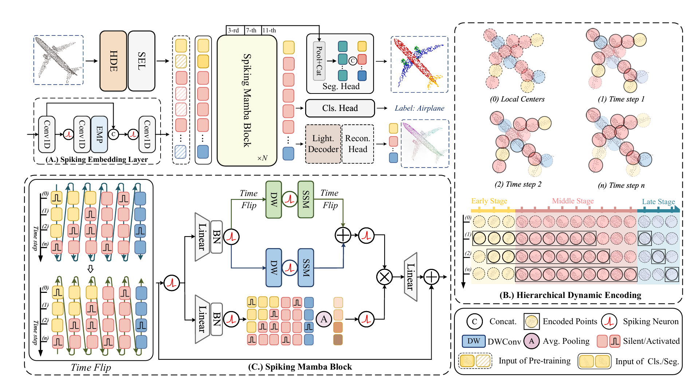

# Spiking Point Mamba (ICCV 2025)


🚀 This is the official PyTorch implementation of the ICCV 2025 paper:  
**[Efficient Spiking Point Mamba for Point Cloud Analysis](https://arxiv.org/pdf/2504.14371)**

## Getting Started

### Datasets

See [DATASET.md](./docs/DATASET.md) for details.

### Environment

See [PREPARE.md](./docs/PREPARE.md) for details.

### Usage

See [USAGE.md](./docs/USAGE.md) for details.

## Acknowledgement
This project is based on PointMamba ([paper](https://proceedings.neurips.cc/paper_files/paper/2024/file/395371f778ebd4854b88521100af30ad-Paper-Conference.pdf), [code](https://github.com/LMD0311/PointMamba)), Point-MAE ([paper](https://arxiv.org/abs/2203.06604), [code](https://github.com/Pang-Yatian/Point-MAE)), Mamba ([paper](https://arxiv.org/abs/2312.00752), [code](https://github.com/state-spaces/mamba)), Causal-Conv1d ([code](https://github.com/Dao-AILab/causal-conv1d)). Thanks for their wonderful works.

## Citation
If you find this work useful, please consider citing:
```bibtex
@article{wu2025efficient,
  title={Efficient Spiking Point Mamba for Point Cloud Analysis},
  author={Wu, Peixi and Chai, Bosong and Zheng, Menghua and Li, Wei and Hu, Zhangchi and Chen, Jie and Zhang, Zheyu and Li, Hebei and Sun, Xiaoyan},
  journal={arXiv preprint arXiv:2504.14371},
  year={2025}
}
```

Feel free to contribute and reach out if you have any questions!


